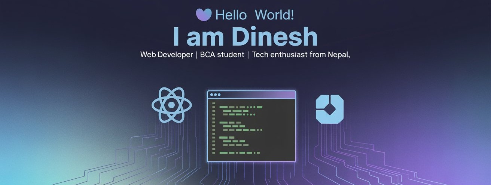

## 💫 Hello World ! I am Dinesh, a Nepali Web developer.
### Studying BCA at Nepathya College currently on Sixth semester

## 🌐 Socials:
   

# 💻 Tech Stack:
                                                    
# 📊 GitHub Stats:
 
 

## 🏆 GitHub Trophies

### 🔝 Top Contributed Repo

---

<!-- Proudly created with GPRM ( https://gprm.itsvg.in ) -->
<picture>
  <source media="(prefers-color-scheme: dark)" srcset="https://raw.githubusercontent.com/Dinesh-Nyaupane/Dinesh-Nyaupane/output/github-snake-dark.svg" />
  <source media="(prefers-color-scheme: light)" srcset="https://raw.githubusercontent.com/Dinesh-Nyaupane/Dinesh-Nyaupane/output/github-snake.svg" />
  
</picture>
